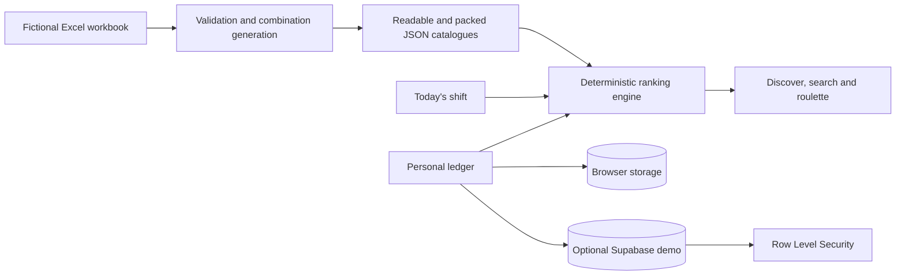

# NovelBite


<p align="center">
  
</p>

NovelBite is a product-first meal recommendation PWA that I built as part of my MSc Data & Computational Science portfolio work.

The project explores how a small, structured dataset can support useful choices when the ranking considers exact-build novelty, ingredient exposure, shift context, comparative nutrition and satiety, personal ratings and diversity across a short recommendation queue.

It is a public-safe reconstruction of a larger private workflow. Restaurant identity, character-inspired assets, private configuration, personal history and the private dataset are deliberately excluded.

> NovelBite is an independent technical case study built with fictional data. It is not affiliated with or endorsed by any restaurant or entertainment brand.

## What the application now demonstrates

- a five-item recommendation queue visible immediately on launch;
- grouped search across meal names, categories and ingredients;
- ranking by overall fit, relative nutrition, satiety, protein, vegetables or novelty;
- exact-build rejection, immediate replacement and Undo;
- weighted roulette that avoids immediately repeating recent draws;
- weekly shift context and late-service weighting;
- exact-build, family and ingredient-level repetition handling;
- an egg cooldown that changes ranking rather than deleting a dish family;
- an optional guard against two flatbread meals on the same day;
- a past-meals-first ledger with richer fullness and next-time feedback;
- small, useful taste-profile analytics;
- guest, local and optional signed-in storage modes;
- Supabase Row Level Security and self-service account deletion;
- a deterministic Excel-to-JSON catalogue pipeline;
- PWA caching, responsive navigation and accessible dialog exit paths;
- automated tests, coverage, a performance budget and a release audit.

The public interface puts the working product first. The MSc case-study explanation, architecture and privacy material remain available under **More** and in the repository documentation instead of occupying the first viewport.

## Project context

I started from a practical question: how can a repeated meal-choice process become faster without simply recommending the same high-scoring option every time?

The private version grew through repeated use and many small corrections to ranking, search, logging and mobile interaction. NovelBite keeps those general product ideas while replacing private data and branding with a reproducible fictional catalogue.

The documentation therefore separates implemented behaviour from assumptions and limitations rather than pretending a personal dataset has achieved universal predictive wisdom.

## Architecture



The browser never receives a secret key. A publishable Supabase key identifies the demo project, while Row Level Security remains the authorization boundary. Client queries also include explicit `user_id` filters.

Read more in [Architecture](docs/architecture.md), [Recommendation engine](docs/recommendation-engine.md), and [Privacy design](docs/privacy-design.md).

## Dataset pipeline

```text
menu-blueprint.json
  -> novelbite-demo.xlsx
  -> workbook validation
  -> combination generation
  -> canonical signature deduplication
  -> scoring
  -> catalog.json + catalog.packed.json
  -> runtime integrity check
```

The public dataset contains two fictional flatbread families and two bowl families expanded over valid addition sets. The deterministic result is exactly **296 unique combinations**.

```bash
npm run data:refresh
```

Generated metadata records the source-workbook SHA-256 checksum, catalogue schema version and recommendation-engine version.

## Recommendation model

Every candidate begins with a dataset-derived base score. Runtime ranking then applies:

1. an unseen-combination boost;
2. an exact-build repetition penalty;
3. smaller family and ingredient-exposure penalties;
4. feedback from previous ratings in the same family;
5. a recent-egg cooldown;
6. shift-length and meal-heaviness fit;
7. late-service and whole-food adjustments;
8. the selected nutrition, satiety, protein, vegetable or novelty priority;
9. short-queue diversity constraints.

Addition signatures are sorted, so changing topping order cannot create false novelty. Equal scores fall back to stable catalogue IDs, keeping the engine deterministic and testable.

The nutrition and satiety values are comparative heuristics derived from the fictional ingredients and heaviness fields. They are not calorie estimates, nutrient labels or medical advice.

## Technology

- semantic HTML and responsive CSS;
- JavaScript ES modules;
- Vite `7.3.6` for local development;
- Supabase JS `2.110.8`;
- Node.js `22.16.0` and its built-in test runner;
- `read-excel-file` and `write-excel-file` for the data pipeline;
- Supabase/PostgreSQL with Row Level Security;
- Cloudflare Workers static assets and service-worker caching;
- GitHub Actions and Dependabot.

Dependencies use exact versions and `package-lock.json` is committed.

## Run locally

Requirements: Node.js `22.16.0`.

```bash
npm ci
npm run dev
```

Guest and local modes require no environment variables. `predev` generates a safe empty `public/config.js` automatically.

Useful commands:

```bash
npm run data:refresh
npm test
npm run test:coverage
npm run benchmark
npm run release:check
```

## Optional Supabase demo

Use a separate public-demo Supabase project. Do not reuse a personal project.

1. Apply `supabase/migrations/001_personal_data_schema.sql`.
2. Apply `supabase/migrations/002_delete_own_account.sql`.
3. Optionally apply `supabase/migrations/003_meal_feedback.sql` for fullness and next-time fields.
4. Configure the production Site URL and allowed redirect URLs.
5. Add these Cloudflare build variables:
   - `SUPABASE_URL`
   - `SUPABASE_PUBLISHABLE_KEY`
   - optional `SUPPORT_URL`

The browser falls back to the v1.0 cloud columns when migration 003 has not yet been applied.

Never place secret keys, `service_role` keys, database passwords, SMTP credentials or Cloudflare credentials in frontend configuration.

## Deploy with Cloudflare

The committed `wrangler.jsonc` deploys `dist/` as static assets and provides the SPA fallback.

| Setting | Value |
| --- | --- |
| Production branch | `main` |
| Build command | `npm run build` |
| Deploy command | `npx wrangler deploy` |
| Node version | `22.16.0` |

Guest and local modes deploy without Supabase variables.

## Testing and quality checks

`npm run release:check` runs syntax checks, catalogue validation, tests with coverage, a ranking benchmark, a production build and a public-release audit.

Automated checks reduce obvious regressions but do not replace browser testing, database integration testing or a formal security review.

## Current limitations

- The public dataset is fictional and intentionally much smaller than the private source project.
- Nutrition and satiety metrics are relative heuristics rather than measured nutritional values.
- Personalisation depends on the amount and quality of ledger history available.
- Supabase cloud mode requires a real two-user RLS verification for each deployed project.
- Automated accessibility checks do not constitute a formal accessibility audit.
- The ranking model is deliberately transparent and deterministic rather than statistically sophisticated.

## Repository map

```text
novelbite/
├── src/                    application and ranking modules
├── data/                   fictional workbook, blueprint and generated outputs
├── scripts/                generation, validation, benchmark and release audit
├── public/                 PWA assets and Cloudflare files
├── supabase/               schema, policies and setup notes
├── tests/                  unit, security and accessibility tests
├── docs/                   architecture and design notes
├── wrangler.jsonc          Cloudflare Workers static-assets configuration
└── .github/workflows/      continuous integration
```

## License

MIT. See [LICENSE](LICENSE).
