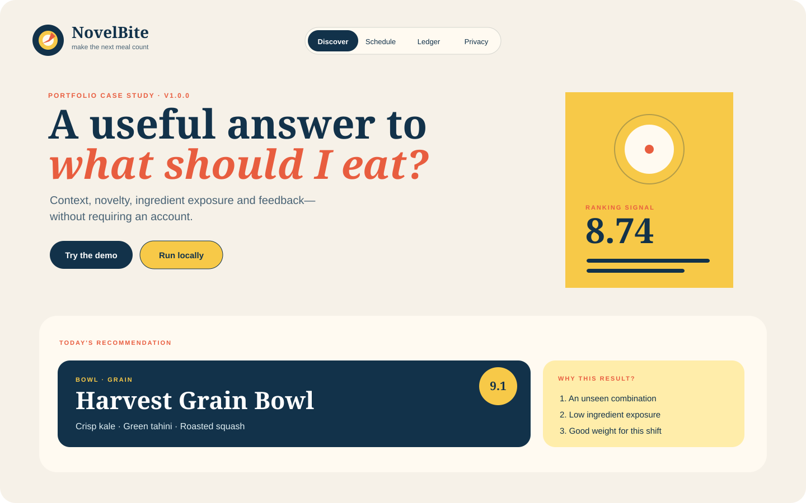
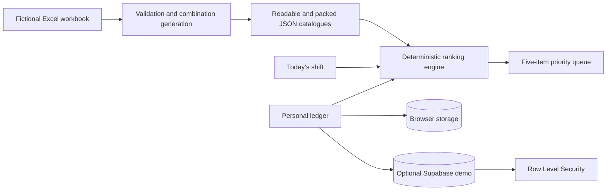

# NovelBite


<p align="center">
  
</p>

NovelBite is a mobile-first meal recommendation PWA that was built as part of my portfolio work.

The project explores how a relatively small, structured dataset can support useful recommendations when the system considers novelty, ingredient repetition, shift timing, personal feedback and variety across a short queue of choices.

It is a public reconstruction of a larger private workflow. Restaurant identity, character-inspired assets, private configuration, personal meal history and the private 5,275-combination dataset are deliberately excluded.

> NovelBite is an independent technical case study built with fictional data.

## Project context

I started this project from a practical question: how can a repetitive meal-choice process be made faster without simply recommending the same highly rated option every time?

The private version grew through repeated use, mobile testing and many small corrections to the recommendation and logging flow. NovelBite is the cleaned public version of that work. It keeps the technical ideas that are useful for a portfolio review while replacing private data and branding with a reproducible fictional dataset.

## What I focused on

- a one-glance five-item recommendation queue;
- exact-build rejection with immediate replacement and Undo;
- a weekly schedule that can automatically provide today’s shift duration;
- exact-build, family and ingredient-level repetition handling;
- an egg cooldown that changes the addition instead of removing the whole dish;
- a past-meals-first ledger with a collapsed logging composer;
- guest, local and optional signed-in storage modes;
- Supabase Row Level Security and self-service account deletion;
- a deterministic Excel-to-JSON catalogue pipeline;
- PWA caching, responsive mobile navigation and accessible modal exit paths;
- automated tests, coverage checks, a performance budget and a release audit.

The aim is not to claim that meal preference has been “solved”. The aim is to show how product decisions, data modelling and deterministic ranking logic can work together in a small end-to-end application.

## Architecture



The browser never receives a secret key. A publishable Supabase key identifies the demo project, while Row Level Security is the main authorization boundary. Client queries also include explicit `user_id` filters.

More detail is available in:

- [Architecture](docs/architecture.md)
- [Recommendation engine](docs/recommendation-engine.md)
- [Privacy design](docs/privacy-design.md)

## Dataset pipeline

```text
menu-blueprint.json
  -> novelbite-demo.xlsx
  -> workbook validation
  -> combination generation
  -> canonical signature deduplication
  -> scoring
  -> catalog.json + catalog.packed.json
  -> runtime integrity check
```

The public dataset contains two fictional flatbread families and two bowl families expanded over valid addition sets. The deterministic result is exactly **296 unique combinations**.

```bash
npm run data:refresh
```

Generated metadata records:

- the source-workbook SHA-256 checksum;
- the catalogue schema version;
- the recommendation-engine version.

Using a generated dataset rather than maintaining hundreds of hand-written rows helped me test reproducibility, deduplication and release validation as part of the same project.

## Recommendation model

Each candidate starts with a dataset-derived base score. Runtime ranking then applies:

1. an unseen-combination boost;
2. an exact-build repetition penalty;
3. smaller family and ingredient-exposure penalties;
4. feedback from previous ratings in the same family;
5. a recent-egg cooldown;
6. shift-length and meal-heaviness fit;
7. service-moment and whole-food adjustments;
8. short-queue diversity constraints.

Addition signatures are sorted, so changing topping order cannot create false novelty. Equal scores fall back to stable catalogue IDs, keeping the engine deterministic and testable.

The recommendation engine is heuristic rather than machine-learning based. That was a deliberate choice: the available personal data is limited, so a transparent scoring model is easier to inspect, test and explain than a model that would imply more statistical confidence than the data supports.

## Technology

- semantic HTML and responsive CSS;
- JavaScript ES modules;
- Vite `7.3.6` for local development;
- Supabase JS `2.110.8`;
- Node.js `22.16.0` and its built-in test runner;
- `read-excel-file` and `write-excel-file` for the public data pipeline;
- Supabase/PostgreSQL with Row Level Security;
- Cloudflare Pages headers, redirects and service-worker caching;
- GitHub Actions and Dependabot.

Dependencies use exact versions and `package-lock.json` is committed.

## Run locally

Requirements: Node.js `22.16.0`.

```bash
npm ci
npm run dev
```

Guest and local modes require no environment variables. `predev` generates a safe empty `public/config.js` automatically.

Useful commands:

```bash
npm run data:refresh
npm test
npm run test:coverage
npm run benchmark
npm run release:check
```

## Optional Supabase demo

Use a separate public-demo Supabase project. Do not reuse a personal or production project.

1. Apply `supabase/migrations/001_personal_data_schema.sql`.
2. Apply `supabase/migrations/002_delete_own_account.sql`.
3. Configure the production Site URL and allowed redirect URLs.
4. Add these Cloudflare build variables:
   - `SUPABASE_URL`
   - `SUPABASE_PUBLISHABLE_KEY`
   - optional `SUPPORT_URL`

The build script writes `public/config.js`. Publishable values remain visible in the browser by design. Secret keys, `service_role` keys, database passwords, SMTP credentials and Cloudflare credentials must never be placed there.

See [Supabase setup](supabase/README.md).

## Deploy with Cloudflare Pages

Create a new Git-integrated Cloudflare Pages project:

| Setting | Value |
| --- | --- |
| Framework preset | None |
| Production branch | `main` |
| Build command | `npm run build` |
| Output directory | `dist` |
| Node version | `22.16.0` |

Guest and local modes deploy without Supabase variables. Pull requests can receive separate preview deployments.

## Testing and quality checks

`npm run release:check` runs:

- JavaScript syntax checks;
- catalogue validation;
- unit and security tests with coverage;
- a ranking benchmark with a 75 ms average budget;
- a production build;
- a public-release audit for private branding, obvious secrets and unfinished placeholders.

The test suite covers:

- catalogue integrity;
- stable signatures;
- novelty ranking;
- egg rotation;
- ingredient exposure;
- short-shift queue constraints;
- ledger comments;
- Row Level Security policy structure;
- explicit user filters;
- 24-hour time parsing;
- overnight shifts;
- service-worker releases;
- static accessibility checks.

These checks reduce obvious regressions, but they do not replace browser testing, database integration testing or a formal security review.

## Privacy and security

| Mode | Identity | Storage | Server writes |
| --- | --- | --- | --- |
| Guest demo | None | Browser local storage with sample history | Never |
| Local mode | None | Browser local storage | Never |
| Signed in | Email magic link | Supabase plus local UI state | Personal rows only |

The app provides JSON export, ledger deletion and account deletion. The seed data contains no users and no personal records.

See:

- [SECURITY.md](SECURITY.md)
- [Privacy design](docs/privacy-design.md)

## Current limitations

- The public dataset is fictional and intentionally much smaller than the private source project.
- Scores are comparative heuristics, not nutritional or medical recommendations.
- Personalisation depends on the amount and quality of ledger history available.
- The Supabase mode still requires a real two-user verification pass for each deployed demo project.
- Accessibility checks include automated static tests, but the application has not undergone a formal accessibility audit.
- The ranking model is designed for transparency and consistency rather than predictive sophistication.
- The project was developed and tested primarily for a personal mobile workflow, so broader user research would be needed before treating the interface as generally validated.

## What I learned

This project gave me practical experience in:

- translating a repeated personal workflow into a data model;
- separating exact-combination novelty from broader family familiarity;
- building a deterministic recommendation system with limited feedback data;
- generating and validating application data from an Excel source;
- designing local-first and optional cloud-backed storage modes;
- applying Row Level Security to user-owned records;
- improving a mobile interface through repeated screenshot and device testing;
- turning a private prototype into a public-safe technical case study;
- adding release checks so the public build is reproducible rather than dependent on one working folder.

## Repository map

```text
novelbite/
├── src/                    application and ranking modules
├── data/                   fictional workbook, blueprint and generated outputs
├── scripts/                generation, validation, benchmark and release audit
├── public/                 PWA assets and Cloudflare files
├── supabase/               schema, policies and setup notes
├── tests/                  unit, security and accessibility tests
├── docs/                   architecture, ADRs and screenshots
├── FIRST_RELEASE.md        first commit, tag and deployment walkthrough
└── .github/workflows/      continuous integration
```

## Release

The first public release is `v1.0.0`.

Follow [FIRST_RELEASE.md](FIRST_RELEASE.md) for the initial commit, GitHub release, Supabase and Cloudflare sequence.

## License

MIT. See [LICENSE](LICENSE).
