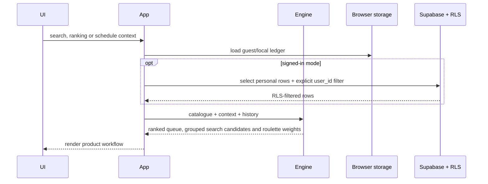

# Architecture

NovelBite separates data preparation, domain logic, persistence and presentation so the recommendation model can be tested without a browser or database.

## Components

| Area | Responsibility |
| --- | --- |
| `scripts/` | Build the workbook, expand combinations, deduplicate, score and validate |
| `data/` | Versioned fictional source, readable output, packed output and metadata |
| `src/recommendations/` | Signatures, comparative metrics, ranking, filtering, queue diversity and roulette |
| `src/schedule/` | Time parsing, overnight duration and saved-shift context |
| `src/ledger/` | Local/cloud ledger persistence and feedback mapping |
| `src/storage/` | Namespaced browser storage and explicit Supabase queries |
| `src/ui/` | Escaped rendering for queue, search, roulette, ledger, analytics and schedule |
| `src/app/` | State, navigation and event orchestration |
| `supabase/` | Schema, indexes, RLS policies, optional feedback migration and account deletion |
| `wrangler.jsonc` | Reproducible Cloudflare Workers static-assets deployment |

## Runtime data flow

## Product-first presentation

Discover, Search, Roulette and Ledger are primary product surfaces. The MSc case-study narrative and privacy explanation live under More and in repository documentation. This keeps the running demo useful to a normal visitor while retaining the technical material needed for portfolio review.

## Trust boundaries

The catalogue and application bundle are public and untrusted by the database. A publishable key is intentionally usable in a browser. Authorization occurs in Postgres: every personal table has RLS enabled and every operation compares `auth.uid()` with `user_id`.

Guest and local modes pass no user to the cloud store, even when a Supabase project is configured. That prevents accidental writes while someone explores the demo.

## Deployment boundary

The portfolio repository uses a separate GitHub repository, Supabase project, Cloudflare Worker, URL and fictional dataset. No private production data is migrated into this project.
