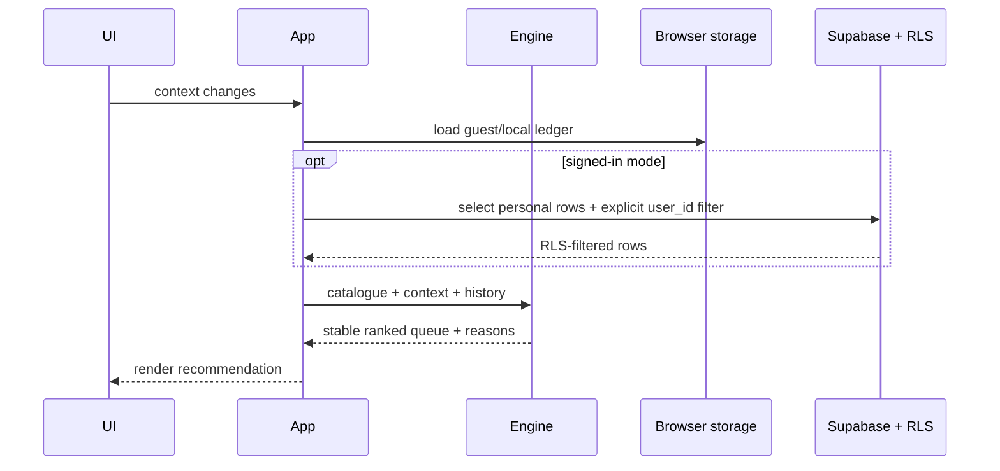

# Architecture

NovelBite separates data preparation, domain logic, persistence, and presentation so
the recommendation model can be tested without a browser or database.

## Components

| Area | Responsibility |
| --- | --- |
| `scripts/` | Build the workbook, expand combinations, deduplicate, score, and validate |
| `data/` | Versioned fictional source, readable output, packed output, and metadata |
| `src/recommendations/` | Pure signatures, scoring, ranking, and queue diversity |
| `src/schedule/` | Time parsing, overnight duration, and short-shift scenarios |
| `src/ledger/` | Local/cloud ledger persistence and row mapping |
| `src/storage/` | Namespaced browser storage and explicit Supabase queries |
| `src/ui/` | Escaped DOM rendering and form extraction |
| `src/app/` | State and event orchestration |
| `supabase/` | Schema, indexes, RLS policies, and account deletion |

## Runtime data flow

## Trust boundaries

The catalogue and application bundle are public and untrusted by the database. A
publishable key is intentionally usable in a browser. Authorization occurs in Postgres:
every personal table has RLS enabled and every operation compares `auth.uid()` with
`user_id`.

Guest and local modes pass no user to the cloud store, even when a Supabase project is
configured. That prevents accidental writes while a recruiter explores the demo.

## Deployment boundary

The portfolio repository must use a separate GitHub repository, Supabase project,
Cloudflare Pages project, URL, and dataset. No production data is migrated into this
project.
